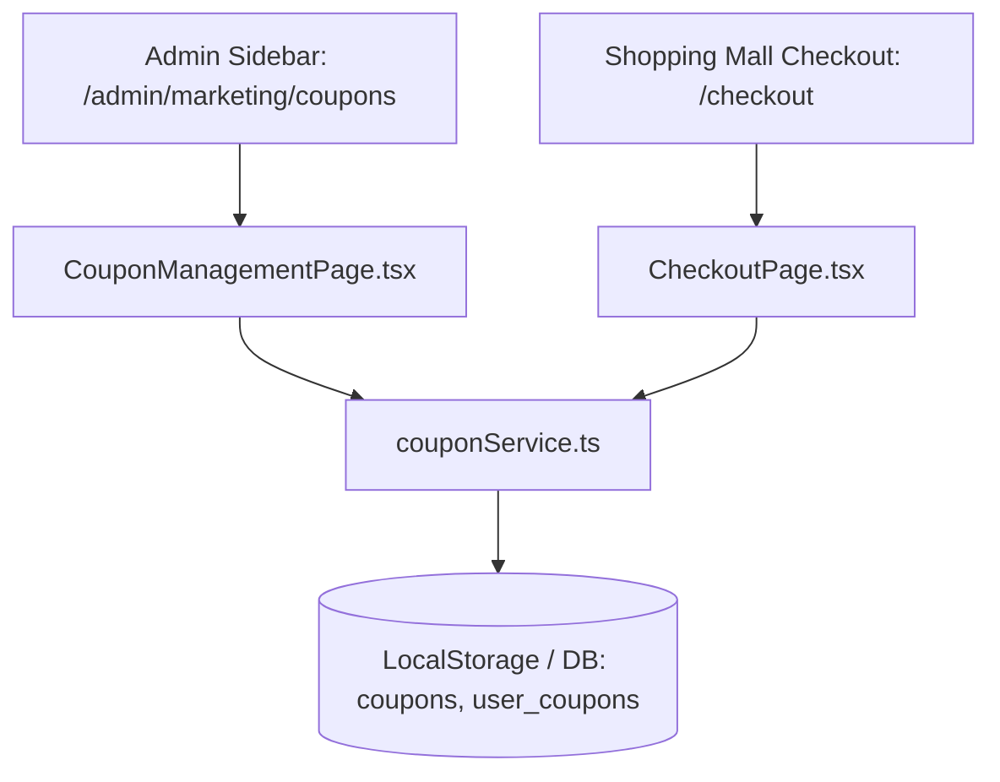

# PDCA Design: 마케팅 쿠폰 관리 및 결제 연동 시스템 설계

## 1. 개요 (Overview)
본 설계 문서는 **마케팅 관리 > 쿠폰 관리** 기능의 데이터 구조, 계산 유틸리티, 관리자 UI 및 결제 화면(`CheckoutPage.tsx`) 연동 구조를 명확히 정의합니다.

---

## 2. 모듈 및 컴포넌트 구조 (Architecture & Components)



### 2.1 주요 파일 및 역할
- [20260728_coupon_management.sql](file:///Users/daniel/Documents/jeisys/docs/db/sql/20260728_coupon_management.sql): `coupons`, `coupon_targets`, `user_coupons` 테이블 생성 SQL
- [coupon.ts](file:///Users/daniel/Documents/jeisys/src/types/coupon.ts): `Coupon`, `UserCoupon`, `DiscountType`, `TargetScope`, `ValidityType` 타입 정의
- [couponService.ts](file:///Users/daniel/Documents/jeisys/src/services/couponService.ts): 쿠폰 CRUD, 회원 발급, 쿠폰 할인액 계산 및 조건 유효성 검증 유틸
- [CouponManagementPage.tsx](file:///Users/daniel/Documents/jeisys/src/pages/admin/marketing/CouponManagementPage.tsx): 어드민 쿠폰 목록 조회/필터, 쿠폰 등록/수정 모달, 회원 발급 모달
- [CheckoutPage.tsx](file:///Users/daniel/Documents/jeisys/src/pages/CheckoutPage.tsx): 보유 쿠폰 선택 및 할인 적용, 할인액 실시간 차감, 주문 완료 시 쿠폰 사용 처리

---

## 3. 핵심 할인 계산 유틸리티 로직 (`couponService.calculateDiscount`)

```typescript
// 1. 쿠폰 활성화 및 유효기간(expiresAt >= now) 검증
// 2. 장바구니 상품 중 targetScope(ALL, CATEGORY, EQUIPMENT, PRODUCT)에 부합하는 대상 추출
// 3. 대상 상품의 합산액(applicableSubtotal) 계산
// 4. 최소 주문 금액(minOrderAmount) 충족 여부 체크
// 5. 정률(%) / 정액(원) 할인액 계산 및 maxDiscountAmount 한도 Capping 적용
```

---

## 4. PDCA 진행 단계
- Current Step: **Design & Do 완료**
- Next Step: **Check & Act (테스트 및 사용자 검토)**
