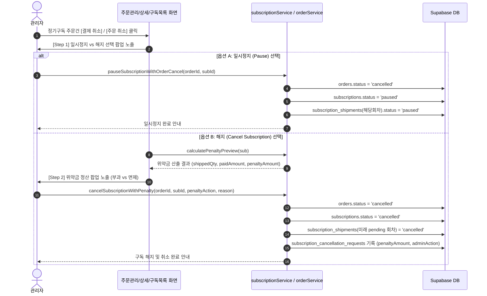

# PDCA Plan: 정기구독 주문 취소 및 위약금 정산 프로세스 (Plan)

> **작성일**: 2026년 8월 5일  
> **작성자**: 봄 (Bom)  
> **목적**: 관리자가 정기구독 주문건을 취소할 때 [일시정지 후 해당회차 재결제 대기] 또는 [구독 완전 해지 + 위약금 정산] 옵션을 선택하여 처리할 수 있는 UX 및 시스템 처리 계획 수립  

---

## 1. 개요 및 변경 배경 (Background)

- **시작 진입점 (Entry Point)**:
  - **관리자 주문/배송 관리 화면 (`/admin/orders` & `/admin/orders/:id`)**: 정기구독 주문건의 **`[주문 취소]` / `[결제 취소]` 버튼 클릭 시 진입**
  - **관리자 정기공급 목록 화면 (`/admin/subscriptions`)**: 정기구독 관리 목록의 **`[구독 해지]` 버튼 클릭 시 진입** (공통 모달 재사용)

- **문제점 및 개선 목적**:
  - 관리자가 정기구독 주문건을 취소할 때 일반 상품 주문처럼 취소되면, 구독 계약과 연동된 미래 회차 스케줄(`subscription_shipments`) 및 자동 결제가 불투명한 상태로 남을 수 있음.
  - 정기구독 취소 상황은 두 가지로 나뉨:
    1. **단순 카드 승인 오류/재결제 목적**: 일시정지 후 해당 회차부터 다시 결제할 수 있는 상태로 보류
    2. **고객 요청/계약 중단 목적**: 완전 구독 해지 + 기출고 상품 할인 혜택에 따른 위약금 정산(부과 또는 면제)

---

## 2. 주요 요구사항 (Requirements)

### 2.1 정기구독 주문 취소 방식 선택 모달 (Cancel Mode Selection)
- 관리자가 주문관리 화면의 정기구독 결제건에서 `[주문 취소]` / `[결제 취소]` 실행 시 **모드 선택 팝업** 노출
- **옵션 A (일시정지)**:
  - 해당 회차 주문 결제 취소 + `subscriptions.status = 'paused'`
  - 해당 회차 스케줄(`subscription_shipments`) 상태를 `paused`로 변경하여, 재개 시 해당 회차부터 재결제 가능하도록 보류
- **옵션 B (구독 해지 및 위약금 정산)**:
  - 해당 회차 주문 결제 취소 + `subscriptions.status = 'cancelled'`
  - 잔여 미래 회차 스케줄(`subscription_shipments`) 상태 `cancelled`로 일괄 변경
  - **Step 2 (위약금 정산 모달)**로 이동

### 2.2 위약금 정산 및 해지 확정 모달 (Penalty Settlement UI)
- `calculatePenalty` 유틸리티를 기반으로 자동 위약금 산출
- **표시 정보**:
  - 기출고 회차 및 수량 (예: 3회차 출고, 150개)
  - 기납부 총액 (예: ₩1,050,000)
  - 정가 기준 금액 (예: ₩1,200,000, 구간 할인율 10% 적용)
  - **산출 위약금 / 중도해지 정산금 (`penaltyAmount`)**: ₩150,000
- **관리자 처리 선택 (Radio)**:
  - `[위약금 부과]` (산출된 위약금을 청구 기록하고 해지)
  - `[위약금 면제]` (관리자 재량으로 ₩0 면제 처리하고 해지)
- **사유 및 메모 필드**: 관리자 사유 기록

---

## 3. UI/UX 디자인 명세 (UI/UX Specification)

### 3.1 [Step 1] 정기구독 취소 옵션 선택 팝업 (`SubscriptionCancelModeModal`)
```
┌─────────────────────────────────────────────────────────────┐
│ 🔄 정기구독 주문 취소 방식 선택                     [X]    │
├─────────────────────────────────────────────────────────────┤
│ 취소 대상 주문: ORD-20260805-001 (정기구독 3회차 결제건)   │
│                                                             │
│ ┌─────────────────────────────────────────────────────────┐ │
│ │ ⏸️ [옵션 A] 구독 일시정지 (Pause & Hold)                 │ │
│ │ - 해당 회차 결제만 취소하고 구독을 일시정지합니다.     │ │
│ │ - 고객/관리자가 추후 해당 회차부터 다시 재결제 가능.   │ │
│ └─────────────────────────────────────────────────────────┘ │
│ ┌─────────────────────────────────────────────────────────┐ │
│ │ 🛑 [옵션 B] 구독 완전 해지 (Cancel Subscription)         │ │
│ │ - 해당 회차 취소와 함께 전체 구독 계약을 해지합니다.   │ │
│ │ - 잔여 회차가 모두 취소되며 위약금 정산 단계로 이동.  │ │
│ └─────────────────────────────────────────────────────────┘ │
│                                                             │
│                      [ 취소 ]  [ 다음 단계 (위약금 정산) → ] │
└─────────────────────────────────────────────────────────────┘
```

### 3.2 [Step 2] 위약금 정산 및 해지 확정 팝업 (`SubscriptionPenaltySettlementModal`)
```
┌─────────────────────────────────────────────────────────────┐
│ ⚖️ 정기구독 해지 및 위약금 정산                       [X]    │
├─────────────────────────────────────────────────────────────┤
│ ┌─────────────────────────────────────────────────────────┐ │
│ │ 📊 정산 요약 내역                                       │ │
│ │ • 기출고 수량: 3회차 (총 150개 출고)                    │ │
│ │ • 기납부 총액: ₩1,050,000                                │ │
│ │ • 정가 재산정 금액: ₩1,200,000 (구간 할인율 10% 적용)    │ │
│ │ • 최종 중도해지 위약금: ₩150,000                       │ │
│ └─────────────────────────────────────────────────────────┘ │
│                                                             │
│ 관리자 위약금 처리 선택:                                   │
│ (o) 위약금 부과 (₩150,000 청구)                             │
│ ( ) 위약금 면제 (₩0 면제 처리)                             │
│                                                             │
│ 해지 및 취소 사유 (필수):                                   │
│ [ 고객 서비스 불만으로 인한 관리자 위약금 면제 해지       ] │
│                                                             │
│                      [ 이전 ]  [ 구독 해지 및 결제 취소 확정 ]│
└─────────────────────────────────────────────────────────────┘
```

---

## 4. 백엔드/서비스 처리 데이터 흐름 (Data Flow)



---

## 5. 검증 계획 (Verification Plan)

1. **일시정지 취소 테스트**:
   - 관리자 주문 관리 화면에서 일시정지 선택 시 주문 취소 + 구독 상태 `paused` 전환 및 해당 회차 재결제 대기 가능 여부 확인
2. **구독 해지 & 위약금 부과 테스트**:
   - 해지 선택 시 위약금 자동 계산값 정확성 검증
   - 위약금 부과 시 `subscription_cancellation_requests` 기록 및 미래 회차 `cancelled` 상태 전환 확인
3. **구독 해지 & 위약금 면제 테스트**:
   - 위약금 면제 시 `penalty_amount = 0`, `admin_action = 'waive'` 상태로 해지 완료되는지 확인
