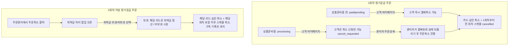

# [PDCA Plan] 정기공급 회차별 결제취소 & 위약금 정산 통합 프로세스

## 1. 개요 및 배경
정기공급 상품 주문건의 1회차 vs 2회차 이상 처리 흐름 및 배송 진행 단계별(상품준비중 전 vs 상품준비중) 결제 취소/취소요청/위약금 정산 프로세스를 명확히 정의하고 시스템 전체에 적용합니다.

---

## 2. 정기공급 결제취소 & 해지 상세 규칙

### 2.1. 1회차 정기공급 주문 (첫 회차 결제건)
1. **[상품준비중 전] (`paid` / `pending`)**:
   - **고객 마이페이지 (`OrdersPage.tsx`)**: **`[결제 취소]` (즉시 취소)** 노출.
   - **취소 시 동작**:
     - 카드 승인 취소
     - 1회차 배송 정보부터 `cancelled` (취소)로 표기 + 나머지 회차 스케줄 배송 건도 **다 취소 처리 (`cancelled`)**
2. **[상품준비중] (`processing`)**:
   - **고객 마이페이지 (`OrdersPage.tsx`)**: 즉시 취소 불가 ➔ **`[취소 신청]` (주문취소요청)** 버튼 제공 (`orders.status = 'cancel_requested'`).
   - **관리자 (`OrderDetailPage.tsx`)**:
     - 취소 요청 확인 후 상태를 `paid` (결제완료)로 되돌리고 관리자가 주문 취소 진행.
     - 카드 승인 취소 + 1회차~마지막 회차 스케줄 전체 `cancelled` 처리.

### 2.2. 2회차 이상 정기공급 주문
1. **관리자 주문관리 (`OrderDetailPage.tsx` or `SubscriptionListPage.tsx`)**:
   - 주문 취소 버튼 클릭 시 **위약금 처리 팝업 (`SubscriptionPenaltySettlementModal.tsx`)** 오픈.
2. **위약금 부과 / 미부과 선택**:
   - **위약금 부과**: 기출고 수량 단가 재산정 위약금 해당 카드로 결제/정산.
   - **위약금 미부과**: 위약금 ₩0원 처리.
3. **카드 승인 취소 & 스케줄 삭제**:
   - 해당 카드 승인 취소.
   - 해당 회차 포함 이후 정기공급 스케줄 일괄 취소/삭제 (`status = 'cancelled'`).
   - 1회 이상 진행되었으므로 정기구독 레코드는 해지된 상태(`status = 'cancelled'`)로 기록을 보존.

---

## 3. 구현 계획

### 3.1. `OrdersPage.tsx` (고객 마이페이지)
- 1회차 + `paid`: `[결제 취소]` 버튼 (즉시 카드 취소 + 1회차~마지막회차 스케줄 `cancelled`).
- 1회차 + `processing`: `[취소 신청]` 버튼 (`cancel_requested` 상태 변경).
- 2회차 이상: 결제 취소 불가, 해지 신청 및 문의 안내.

### 3.2. `OrderDetailPage.tsx` (관리자 주문 상세)
- 1회차 `processing` 주문건: `[결제완료 상태로 변경]` 및 `[주문 취소]` 기능 제공.
- 2회차 이상 주문건 `[주문 취소]` 클릭 시: `SubscriptionPenaltySettlementModal` 오픈 ➔ 위약금 선택 ➔ 카드 승인 취소 ➔ 스케줄 취소.

### 3.3. `SubscriptionPenaltySettlementModal.tsx` & `subscriptionService.ts`
- 위약금 부과/미부과 옵션 적용 및 카드 승인 취소 + 해당 회차 포함 이후 스케줄 일괄 취소 연동.

---

## 4. 검증 계획
1. `npm run build` 실행하여 컴파일 오류 검증
2. 1회차 `paid` 시 고객 마이페이지 즉시 취소 ➔ 카드 취소 + 1회차~마지막회차 스케줄 취소 확인
3. 1회차 `processing` 시 고객 마이페이지 취소 신청 ➔ 관리자 결제완료 변경 후 취소 확인
4. 2회차 이상 시 위약금 팝업 오픈 ➔ 부과/미부과 ➔ 카드 취소 + 이후 스케줄 취소 및 구독 이력 보존 확인
