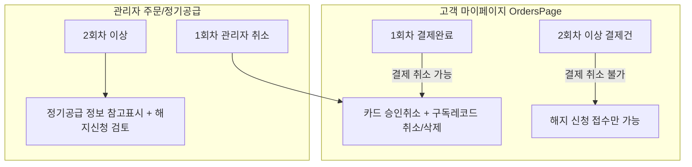

# [PDCA Plan] 정기공급 결제취소 및 구독삭제 정책 단권화

## 1. 개요 및 배경
정기공급 상품 주문건의 결제 취소 및 구독 관리에 대해 복잡한 모달 절차 대신, **1회차(첫 결제) vs 2회차 이상**의 현실적 비즈니스 도메인 규칙을 명확히 정의하고 시스템 전체(마이페이지, 주문관리, 정기공급목록)에 일관되게 적용합니다.

---

## 2. 세부 정기공급 취소/해지 정책

### 2.1. 1회차 정기공급 주문 (첫 회차 결제건)
1. **[상품준비중 전] 고객 마이페이지 (`OrdersPage.tsx`)**:
   - 정기공급상품이라도 1회차 상품배송 시작 전(결제완료 상태)이면 **`[결제 취소]` 버튼을 노출**하여 고객이 직접 즉시 취소 가능.
   - **취소 시 동작**:
     - PG 카드 승인 결제 취소
     - 주문 상태 `orders.status = 'cancelled'`
     - 생성된 구독 레코드 삭제/완전 취소 (`subscriptions.status = 'cancelled'`, `subscription_shipments` 취소)
2. **[상품준비중 이상] 관리자 주문/정기공급 관리 (`OrderDetailPage.tsx`, `SubscriptionListPage.tsx`)**:
   - 관리자가 주문 취소 진행 시 **카드 승인 취소 + 정기공급 관련 내역 완전 삭제/취소** 동일 적용.
   - 1회차 출고 전 취소 시 위약금/일시정지 복잡 팝업 없이 **원클릭 카드 결제 취소 & 구독 취소**로 처리.

### 2.2. 2회차 이상 정기공급 주문
1. **이미 결제된 주문건 취소 불가**:
   - 고객 및 관리자 임의 취소 버튼 비활성화/숨김.
2. **해지 신청 절차로 일원화**:
   - 고객은 마이페이지에서 **[해지 신청]**을 통해서만 접수 가능.
   - 관리자는 해지 신청 관리 메뉴에서 위약금 정산 및 검토 후 **구독 해지 승인**으로 처리.
3. **정보 카드 참조 용도**:
   - 정기공급 주문 내역에는 정기공급 정보(주기, 회차, 금액 등)를 참고용 카드로만 표시.

---

## 3. 화면별 변경 사항

### 3.1. `OrdersPage.tsx` (고객 마이페이지)
- `1회차` + `paid` (상품준비중 전) 주문건은 **`[결제 취소]` 버튼 노출 허용**.
- `2회차 이상` 주문건은 **`[결제 취소]` 및 `[재주문]` 버튼 숨김**.

### 3.2. `OrderDetailPage.tsx` & `SubscriptionListPage.tsx` (관리자)
- 1회차 결제건 취소 시: 복잡한 모달 없이 **카드 결제 승인 취소 + 구독 레코드 취소/삭제**로 즉시 원복 처리.
- 2회차 이상 결제건: 임의 결제 취소를 제한하고 **해지 신청 관리 절차**로 안내.

---

## 4. 검증 계획
1. `npm run build` 빌드 검증
2. 고객 마이페이지에서 1회차 결제완료 주문 `[결제 취소]` 버튼 노출 및 취소 시 구독 삭제 확인
3. 2회차 이상 주문 결제 취소 불가 확인 및 해지 신청 흐름 검증
