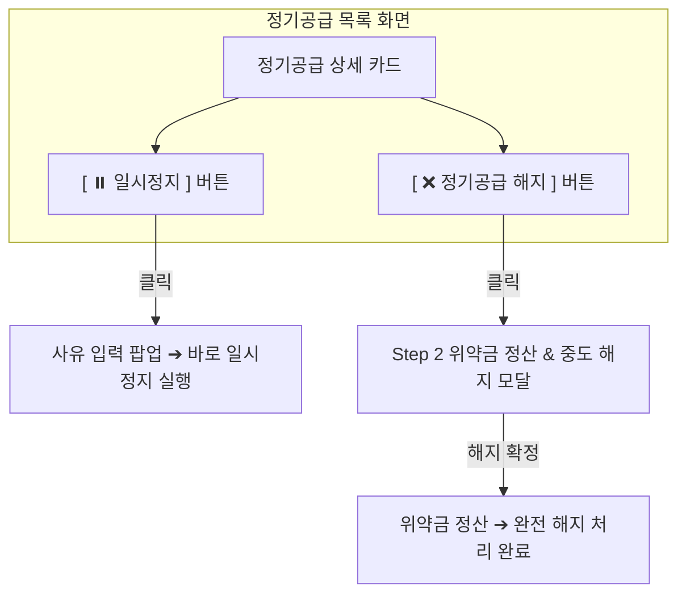

# [PDCA Plan] 정기공급 목록 직관적 액션 분리 (일시정지 / 직접 해지)

## 1. 개요 및 목적
기존 주문관리(`/admin/orders`)에서는 주문 취소 시 구독을 잠시 정지할지(일시정지), 완전 끊을지(해지) 선택하는 2단계 모달(Step 1 ➔ Step 2)이 필요합니다.
그러나 **정기공급 목록(`/admin/subscriptions`)** 화면은 보라색 상세 카드 내부에 **`[일시정지]`** 버튼과 **`[정기공급 해지]`** 버튼이 이미 각각 독립적으로 분리되어 존재합니다.

따라서 정기공급 목록 화면에서는 중복된 Step 1(모드 선택)을 생략하고:
1. **`[ ⏸️ 일시정지 ]`** 클릭 ➔ 사유 입력 후 즉시 일시정지(Status: `paused`) 실행
2. **`[ ❌ 정기공급 해지 ]`** 클릭 (버튼명: `정기공급 취소` ➔ `정기공급 해지`) ➔ 모드 선택 없이 바로 **위약금 정산 및 해지 모달(Step 2)**로 진입하여 직관적으로 완전 해지(Status: `cancelled`) 처리하도록 개편합니다.

---

## 2. 변경 UX 워크플로우

---

## 3. 세부 변경 계획

### 3.1. `SubscriptionListPage.tsx` UI & 이벤트 개편
1. **버튼 명칭 변경**:
   - `[ ❌ 정기공급 취소 ]` ➔ **`[ ❌ 정기공급 해지 ]`**
2. **직접 액션 매핑**:
   - `[ ⏸️ 일시정지 ]` 클릭 ➔ 사유 입력 팝업 실행 후 `subscriptionService.pauseSubscriptionWithOrderCancel(...)` 실행 (Status: `paused`)
   - `[ ❌ 정기공급 해지 ]` 클릭 ➔ Step 1 모드 선택을 거치지 않고 바로 **`SubscriptionPenaltySettlementModal` (Step 2 모달)** 팝업 오픈

### 3.2. `OrderDetailPage.tsx` 유지
- 주문상세화면에서는 고객 주문 취소 시 일시정지/해지 선택 여부를 물어야 하므로 기존 2단계(Step 1 ➔ Step 2) 흐름 유지.

---

## 4. 검증 계획
1. `npm run build` 컴파일 빌드 검증
2. `/admin/subscriptions` 화면에서 `[일시정지]` 클릭 시 즉시 정지 동작 확인
3. `/admin/subscriptions` 화면에서 `[정기공급 해지]` 클릭 시 Step 1 없이 바로 위약금 정산 팝업(Step 2) 노출 확인
